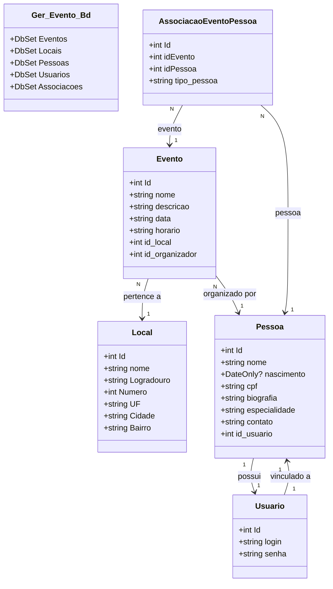

```mermaid
classDiagram
direction TB
    class Ger_Evento_Bd {
	    +DbSet Associacoes
	    +DbSet Locais
	    +DbSet Pessoas
	    +DbSet Usuarios
    }
    class IAssociacaoEventoPessoa {
	    +Task ObterAssociacaoAsync(int idEvento, int idPessoa)
	    +Task&gt; ObterEventosAsync(int idPessoa)
	    +Task&gt; ObterPessoasAsync(int idEvento)
	    +Task AdicionarAsync(AssociacaoEventoPessoa associacao)
	    +Task RemoverAsync(int idEvento, int idPessoa)
    }
    class ILocalRepository {
	    +Task&gt; ObterLocaisAsync()
	    +Task ObterPorIdAsync(int id)
	    +Task AdicionarAsync(Local local)
	    +Task AtualizarAsync(Local local)
	    +Task DeletarAsync(int id)
	    +Task ExisteAsync(int id)
    }
    class IPessoaRepository {
	    +Task&gt; ObterTodosAsync()
	    +Task ObterPorIdAsync(int id)
	    +Task AdicionarAsync(Pessoa pessoa)
	    +Task AtualizarAsync(Pessoa pessoa)
	    +Task DeletarAsync(int id)
	    +Task ExisteAsync(int id)
	    +Task ObterPorLoginSenhaAsync(string login, string senha)
    }
    class IUsuarioRepository {
	    +Task ObterPorLoginESenhaAsync(string login, string senha)
	    +Task&gt; ObterLoginsAsync()
	    +Task ObterLoginAsync(int idPessoa)
	    +Task AdicionarAsync(Usuario usuario)
	    +Task AtualizarAsync(Usuario usuario)
	    +Task DeletarAsync(int id)
	    +Task ExisteAsync(int id)
    }
    class AssociacaoEventoPessoaRepository {
	    +Task ObterAssociacaoAsync(int idEvento, int idPessoa)
	    +Task&gt; ObterEventosAsync(int idPessoa)
	    +Task&gt; ObterPessoasAsync(int idEvento)
	    +Task AdicionarAsync(AssociacaoEventoPessoa associacao)
	    +Task RemoverAsync(int idEvento, int idPessoa)
    }
    class LocalRepository {
	    +Task&gt; ObterLocaisAsync()
	    +Task ObterPorIdAsync(int id)
	    +Task AdicionarAsync(Local local)
	    +Task AtualizarAsync(Local local)
	    +Task DeletarAsync(int id)
	    +Task ExisteAsync(int id)
    }
    class PessoaRepository {
	    +Task&gt; ObterTodosAsync()
	    +Task ObterPorIdAsync(int id)
	    +Task AdicionarAsync(Pessoa pessoa)
	    +Task AtualizarAsync(Pessoa pessoa)
	    +Task DeletarAsync(int id)
	    +Task ExisteAsync(int id)
	    +Task ObterPorLoginSenhaAsync(string login, string senha)
    }
    class UsuarioRepository {
	    +Task ObterPorLoginESenhaAsync(string login, string senha)
	    +Task&gt; ObterLoginsAsync()
	    +Task ObterLoginAsync(int idPessoa)
	    +Task AdicionarAsync(Usuario usuario)
	    +Task AtualizarAsync(Usuario usuario)
	    +Task DeletarAsync(int id)
	    +Task ExisteAsync(int id)
    }

    AssociacaoEventoPessoaRepository --> IAssociacaoEventoPessoa
    LocalRepository --> ILocalRepository
    PessoaRepository --> IPessoaRepository
    UsuarioRepository --> IUsuarioRepository
    AssociacaoEventoPessoaRepository --> Ger_Evento_Bd
    LocalRepository --> Ger_Evento_Bd
    PessoaRepository --> Ger_Evento_Bd
    UsuarioRepository --> Ger_Evento_Bd

```

# DOCUMENTAÇÃO DO PROJETO
## EventMaster

SÚMARIO

1. **[Equipe](#equipe)**
2. **[Objetivo Estratégico do Projeto](#objetivo-estratégico-do-projeto)**
3. **[Resumo do Projeto](#resumo-do-projeto)**
4. **[Imersão](#imersão)**
    1. **[Problemas que o Projeto Visa Resolver](#problemas-que-o-projeto-visa-resolver)**
    2. **[Pessoas que o Projeto Visa Ajudar](#pessoas-que-o-projeto-visa-ajudar)**
    3. **[Benefícios do Projeto](#beneficios-do-projeto)**
    4. **[Produtos Semelhantes](#produtos-semelhantes)**
    6. **[Soluções Encontradas](#solucoes-encontradas)**
    7. **[Diferencial do Projeto](#diferencial-do-projeto)**
5. **[Backlog do Projeto](#backlog-do-projeto)**
6. **[Construção do Projeto](#construcao-do-projeto)**
    1. **[Tecnologia Utilizada](#tecnologia-utilizada)**
7. **[Diagramas](#diagramas)**
    1. **[Diagrama de Projeto](#diagrama-de-projeto)**
    2. **[Diagrama de Classes](#diagrama-de-classes)**
8. **[Estruturas de Pastas MVC](#estruturas-de-pastas-mvc)**

### EQUIPE

| Nome                     | Papel         |
|--------------------------|---------------|
| Eduardo Pitanga Loureiro | Desenvolvedor |
| Theo Mischiatti Gomes    | Desenvolvedor |

### OBJETIVO ESTRATÉGICO DO PROJETO

**O objetivo estratégico do projeto é definido pela seguinte frase:**

&emsp;Nosso objetivo é fornecer uma plataforma intuitiva e eficiente que permita a criação, organização e gestão de eventos de forma simplificada, proporcionando uma experiência otimizada para os usuarios, com foco em aumentar a produtividade, reduzir custos e melhorar a interação nos eventos.

### RESUMO DO PROJETO

&emsp;O EventMaster é uma plataforma digital desenvolvida para facilitar a criação e a gestão de eventos, além de permitir o controle e a organização de participantes, palestrantes e organizadores. O sistema é estruturado de forma a atender diferentes tipos de usuários, sendo eles: participantes, palestrantes e organizadores, cada um com suas características e responsabilidades dentro da plataforma. Todos esses usuários possuem informações comuns, como nome, CPF, data de nascimento, biografia e especialidade.

&emsp;Todos os usuários tem a opção de organizar, palestrar e participar de um evento. Participantes tem a possibilidade de se inscrever e desinscrever de eventos. Palestrantes podem se desvincular de um evento, mas só podem ser vinculados por meio do organizador. O organizador é quem cria, gerencia e edita as informações do evento.

&emsp;Um evento dentro da plataforma é composto por várias informações, como o nome, descrição, data, horário, local, o organizador responsável. Além disso, um evento possui palestrantes envolvidos e participantes que estão inscritos. O evento precisa estar associado a um organizador e a um local previamente cadastrados no sistema, sendo que a associação de palestrantes e participantes pode ser feita posteriormente, conforme a evolução do planejamento do evento.

&emsp;O local de um evento é composto por informações como nome, logradouro, número, UF, cidade e bairro, permitindo que os eventos sejam mapeados para um espaço específico. Para a criação de um evento, é obrigatório associar um organizador e um local que já estejam cadastrados no sistema.

&emsp;Além disso, o sistema oferece a capacidade de inserir e remover tanto participantes quanto palestrantes de um evento. Isso é necessário porque ambos podem, eventualmente, cancelar sua presença.

&emsp;A plataforma também permite apagar e atualizar qualquer uma das entidades cadastradas no sistema, sejam eventos, pessoas (participantes, palestrantes ou organizadores) ou locais. No caso de exclusão de um evento, é preciso desassociar todos os participantes, palestrantes e organizadores vinculados ao evento. A mesma lógica se aplica para a exclusão de uma pessoa ou um local. Essa regra não se aplica ao organizador, que não pode ser excluído se estiver vinculado a um evento ativo. Isso garante que os eventos sempre tenham um organizador designado.

### IMERSÃO
A Imersão tem como objetivo entender o problema e, assim, determinar o Produto Mínimo e Viável (MVP, do inglês, Minimum Viable Product). Essa atividade ajuda no desenvolvimento do planejamento do projeto. Ao fim dessa atividade, a equipe sabe as funcionalidades mínimas que devem ser produzidas para atender as necessidades do público alvo do produto

#### PROBLEMAS QUE O PROJETO VISA RESOLVER
O projeto visa resolver principalmente o problema encontrado para se gerenciar eventos, principalmente eventos em que é necessário ter um controle de participantes inscritos, devido a limitação de no número de vagas disponíveis.
</br>Gerenciar eventos pode ser uma tarefa desafiadora, mas que é facilitada por meio da utilização do sistema proposto.

#### PESSOAS QUE O PROJETO VISA AJUDAR
O projeto tem como objetivo atender os seguintes tipos de pessoa:
1. Organizadores, que são as pessoas que irão organizar eventos e associar palestrantes;
2. Palestrantes, que poderão visualizar eventos que irão ministrar;
3. Participantes, que irão escolher eventos para se inscrever.

#### BENEFICIOS DO PROJETO
* Facilidade de gerenciamento de eventos
* Facilidade para inscrição de pessoas
* Facilidade para criação de locais
* Facilidade para criação de eventos

#### PRODUTOS SEMELHANTES
* [Gerenciador de Eventos da Meta](https://www.facebook.com/business/help/898185560232180)

#### SOLUÇÕES ENCONTRADAS
Para o desenvolvimento do nosso projeto, optamos por utilizar a linguagem C#. Essa escolha foi motivada por dois fatores principais: primeiro, a oportunidade de aprendizado, já que se trata de uma linguagem nova para os integrantes do grupo, permitindo-nos explorar e aprofundar nossos conhecimentos. Segundo, a facilidade oferecida pela linguagem para a criação de entidades em um banco de dados InMemory, característica que se mostrou bastante útil no contexto do projeto. Além disso, o C# foi abordado em sala de aula, com foco em aplicações web, o que reforçou sua relevância para o projeto.

Adotamos o modelo de desenvolvimento MVC, que promove uma estrutura modular e segue boas práticas de programação. Esse modelo permite a criação de:

* Model, incluindo DTOs e entidades;
* View, responsável pela interface com o usuário (nesse caso não implementado pela falta de interface gráfica);
* Controller, que gerencia as interações entre a interface e a lógica de negócio.

Para garantir uma arquitetura bem estruturada, implementamos também um Repository com interfaces e suas respectivas implementações, e um Service, onde implementamos nossas regras de negócio.

Entre os pacotes instalados para o projeto, destacam-se o Microsoft.EntityFrameworkCore e o Microsoft.EntityFrameworkCore.InMemory, que foram fundamentais para a construção e manipulação do banco de dados utilizado.

#### DIFERENCIAL DO PROJETO
Nosso diferencial é promover um projeto que seja funcional e simples ao mesmo tempo, que possa atender a alguém que não tenha um conhecimento tecnolócigo muito aprofundado.

Apesar de simples, o projeto oferece um ótimo gerenciamento de eventos.

#### BACKLOG DO PROJETO

| **ID** | **História do Usuário**                                                                                  | **MoSCoW**  | **Importância** | **RoadMap**   |
|--------|----------------------------------------------------------------------------------------------------------|-------------|-----------------|---------------|
| 1      | Como participante, quero me inscrever em eventos para participar de palestras e workshops.               | Must Have   | Alta            | Sprint 1      |
| 2      | Como organizador, quero gerenciar a lista de palestrantes para garantir que as informações estejam atualizadas. | Should Have | Média           | Sprint 2      |
| 3      | Como administrador, quero remover participantes que cancelaram a inscrição para manter a lista atualizada. | Must Have   | Alta            | Sprint 1      |
| 4      | Como palestrante, quero editar minha biografia e especialidades para informar melhor os participantes.    | Should Have | Baixa           | Sprint 3      |
| 5      | Como organizador, quero visualizar relatórios de eventos para avaliar o sucesso e engajamento.           | Must Have   | Alta            | Sprint 2      |

### CONSTRUÇÃO DO PROJETO

#### TECNOLOGIA UTILIZADA
Para nosso projeto, usamos a linguagem C# da Microsoft, por ser uma oportunidade de aprendermos uma nova linguagem e por ser semelhante ao Java, que já conheciamos. Além disso, a linguagem C# trouxe algumas facilidades como a criação de um banco InMemory e da criação de Tabelas por meio de Classes.

#### DIAGRAMA DE PROJETO

```mermaid
classDiagram
    class EventoController {
        +GetEventos() : Task<ActionResult<IEnumerable<EventoDTOResponse>>>
        +GetEvento(int id) : Task<ActionResult<EventoDTOResponse>>
        +PostEvento(EventoDTORequest eventoRequestDTO) : Task<ActionResult<EventoDTOResponse>>
        +PutEvento(int id, EventoDTORequest eventoRequestDTO) : Task<IActionResult>
        +DeleteEvento(int id) : Task<IActionResult>
    }

    class ControllerInscricao {
        +AddParticipante(int eventoId, int participanteId) : Task<IActionResult>
        +AddPalestrante(int eventoId, int palestranteId) : Task<IActionResult>
        +DeleteParticipanteEvento(int eventoId, int participanteId) : Task<IActionResult>
        +DeletePalestranteEvento(int eventoId, int palestranteId) : Task<IActionResult>
    }

    class ControllerLocal {
        +GetLocais() : Task<ActionResult<IEnumerable<LocalDTOResponse>>>
        +GetLocal(int id) : Task<ActionResult<LocalDTOResponse>>
        +PostLocal(LocalDTORequest localDto) : Task<ActionResult<LocalDTOResponse>>
        +PutLocal(int id, LocalDTORequest localDto) : Task<IActionResult>
        +DeleteLocal(int localId) : Task<IActionResult>
    }

    class LoginController {
        +Login(string login, string senha) : Task<ActionResult<Pessoa?>>
    }

    class PessoaController {
        +GetPessoas() : Task<ActionResult<IEnumerable<PessoaDTOResponse>>>
        +GetPessoas(int id) : Task<ActionResult<PessoaDTOResponse>>
        +PostPessoa(PessoaDTORequest pessoaDTO) : Task<ActionResult<PessoaDTOResponse>>
        +PutPessoa(int id, PessoaDTORequest pessoaDTO) : Task<IActionResult>
        +DeletePessoa(int id) : Task<IActionResult>
    }

    class EventoDTORequest {
        +string Nome
        +string? Descricao
        +string? Data
        +string? Horario
        +int IdLocal
        +int IdOrganizador
        +List<int> Palestrantes
        +List<int> Participantes
    }

    class EventoDTOResponse {
        +int Id
        +string Nome
        +string? Descricao
        +string? Data
        +string? Horario
        +int IdLocal
        +int IdOrganizador
        +List<int> Palestrantes
        +List<int> Participantes
    }

    class LocalDTORequest {
        +int Id
        +string Nome
        +string Logradouro
        +int Numero
        +string UF
        +string Cidade
        +string Bairro
    }

    class LocalDTOResponse {
        +int Id
        +string Nome
        +string Logradouro
        +int Numero
        +string UF
        +string Cidade
        +string Bairro
    }

    class PessoaDTORequest {
        +int Id
        +string? Nome
        +DateOnly? Nascimento
        +string? Cpf
        +string? Biografia
        +string? Especialidade
        +string? Contato
        +string? Login
        +string? Senha
    }

    class PessoaDTOResponse {
        +string? Nome
        +DateOnly? Nascimento
        +string? Cpf
        +List<int> EventosInscritos
    }

    EventoController --> EventoDTORequest
    EventoController --> EventoDTOResponse
    ControllerLocal --> LocalDTORequest
    ControllerLocal --> LocalDTOResponse
    PessoaController --> PessoaDTORequest
    PessoaController --> PessoaDTOResponse

```

* CONTROLLER E DTO </br>


* REPOSITORY </br>


#### MODEL </br>

#### ESTRUTURAS DO PROJETO
```
eventos_ger
│
├───Aplication
│       Program.cs
│
├───Controller
│       ControllerEvento.cs
│       ControllerInscricao.cs
│       ControllerLocal.cs
│       ControllerLogin.cs
│       ControllerPessoa.cs
│
├───Model
│   ├───DTOs
│   │   ├───Request
│   │   │       eventoRequest.cs
│   │   │       localRequest.cs
│   │   │       loginRequest.cs
│   │   │       pessoaRequest.cs
│   │   │
│   │   └───Response
│   │           eventoResponse.cs
│   │           localResponse.cs
│   │           loginResponse.cs
│   │           pessoaResponse.cs
│   │
│   └───Entity
│           AssociacaoEventoPessoa.cs
│           Evento.cs
│           Ger_Evento_Bd.cs
│           Local.cs
│           Pessoa.cs
│           Usuario.cs
│
├───Repository
│   ├───Implementations
│   │       AssociacaoEventoPessoaRepository.cs
│   │       EventoRepository.cs
│   │       LocalRepository.cs
│   │       PessoaRepository.cs
│   │       UsuarioRepository.cs
│   │
│   └───Interfaces
│           IAssociacaoEventoPessoa.cs
│           IEventoRepository.cs
│           ILocalRepository.cs
│           IPessoaRepository.cs
│           IUsuarioRepository.cs
│
└───Service
    ├───Implementations
    │       EventoService.cs
    │       InscricaoService.cs
    │       LocalService.cs
    │       OrganizadorService.cs
    │       PalestranteService.cs
    │       ParticipanteService.cs
    │       PessoaService.cs
    │
    └───Interface
            IEventoService.cs
            IInscricaoService.cs
            ILocalService.cs
            IOrganizadorService.cs
            IPalestranteService.cs
            IParticipanteService.cs
            IPessoaService.cs
```
